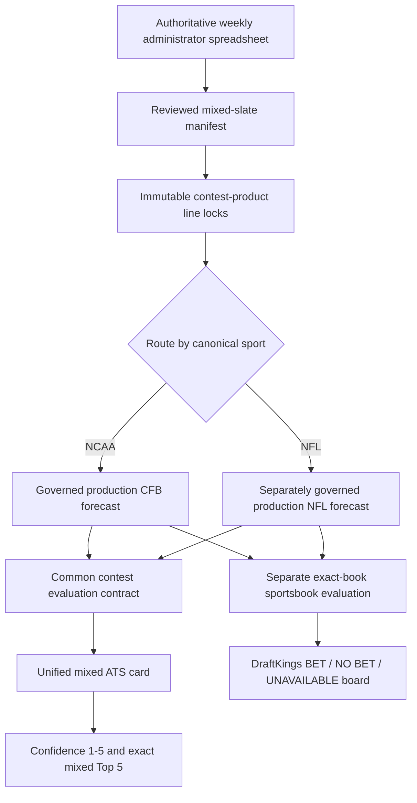

# Mixed NCAA + NFL Pick'em — Phase 0 architecture and source audit

Status: proposed architecture; no production implementation

Decision date: 2026-08-27

Repository baseline: `18c803a` (`Merge PR #22: governed recurring production scheduling`)

Scope: architecture, data-source feasibility, and future pull-request plan only

## 1. Decision summary

Use **Option 1: evolve this V3 repository into a broader football platform**, but
do it additively and behind product-specific adapters. Keep the existing
SplashSports CFB product on its current schema, policies, schedule, dashboard,
EPA-only model, and durable stream until separately reviewed migrations prove
behavioral parity. Build the mixed product on a sport-aware identity and
contest layer in the same repository, with a separate managed-state stream and
separate production enablement.

This is one mixed contest product, not one mixed predictive model:



The repository choice is based on four facts in merged `main`:

1. Provider custody, immutable history, card publication, sportsbook custody,
   postgame audit, cloud execution, and managed persistence are already
   substantial shared infrastructure.
2. A mixed card needs one atomic completeness gate across NCAA and NFL games.
   Cross-repository orchestration would add distributed consistency and
   release-version problems without improving model independence.
3. Important current types are CFB-specific: `teams` has `school`, `games` has
   no sport, `contest_cards` has one `model_run_id`, controller policy is fixed
   to SplashSports/EPA-only, and the dashboard explicitly rejects any source
   other than SplashSports. Generalization must therefore be additive, not a
   broad rename or in-place semantic overload.
4. Separate durable product streams, policy namespaces, provider credentials,
   feature registries, and activation gates provide failure isolation inside a
   single codebase.

No repository migration, schema migration, provider call, model selection, or
production activation is part of Phase 0.

## 2. Binding product boundaries

### 2.1 Existing product: SplashSports CFB

The existing product remains exactly as implemented after PR #22:

- CFB-only and FBS full-card coverage;
- SplashSports as the authoritative contest-line source;
- permanent immutable locks and append-only corrections;
- the active `epa_only` / `epa-only-linear-v1` model;
- existing CFB Confidence and Top 5 policies;
- Tuesday-through-Saturday card lifecycle and current production schedule;
- separate DraftKings recommendations, closing designations, CLV, grading,
  context, diagnostics, cloud execution, and public dashboard.

The mixed product must not call the current CFB controller with different
policy values, add NFL rows to legacy CFB tables, change the current schedule,
or reinterpret any existing column.

### 2.2 New product: mixed NCAA + NFL Pick'em

The administrator spreadsheet is the sole authority for the weekly slate,
spread, and row count. The system must not reconstruct the administrator's
selection logic. A valid locked slate has one ATS pick for every listed game,
whether the slate has 15 games, fewer than 15, or more than 15.

The mixed product has its own:

- contest-product and season identity;
- 20 contest-round numbers, independent of NCAA and NFL week numbers;
- spreadsheet custody, review, approval, and line-lock batch;
- card, revision, ranking, Confidence, and publication policies;
- state stream and production switches;
- dashboard payload and optional standings publication policy.

It reuses shared implementation primitives only through explicit interfaces.

### 2.3 Decision-layer separation

The following records remain different business entities:

| Layer | Required inputs | Required output | Prohibited coupling |
| --- | --- | --- | --- |
| Model forecast | Sport-specific PIT features and model version | Fair home margin, predictive uncertainty/distribution, model metadata | No contest selection, stake, or mutable line |
| Contest evaluation/pick | One forecast or explicit fallback plus one immutable contest-product line | Mandatory side, calibrated win/push/loss probabilities, Confidence 1-5, full-card rank, Top 5 flag | No claim that the pick is a wager |
| Sportsbook evaluation | One forecast plus one exact, current, two-sided book offer and price | `BET`, `NO BET`, or `UNAVAILABLE`, EV and stake policy | No contest-line substitution and no wager placement |

The same event may have independent SplashSports, mixed-pool, DraftKings
opening/current/closing, and other-book records. Identity is
`(contest_product, contest_round, event, lock sequence)` for a contest line and
`(provider, bookmaker, event, market, observed_at)` for a market offer. One can
never overwrite or stand in for another.

## 3. Current V3 reuse audit

Classification:

- **A — reuse unchanged**: semantics and implementation can be shared as-is.
- **B — reuse after generalization**: the control is sound, but identity,
  policy, or orchestration is CFB-specific.
- **C — remain NCAA-specific**: keep behind the existing CFB adapter.
- **D — new NFL-specific implementation**: do not infer it from CFB behavior.

| Component | Class | Repository evidence and required treatment |
| --- | --- | --- |
| Canonical JSON/checksum helpers | A | Reuse deterministic hashing and credential sanitization. Namespace hashes by artifact version. |
| Migration ledger and disposable-copy verification | A | Reuse ordering, checksums, integrity, FK, and row-preservation checks. Any future schema change is a new migration. |
| Managed PostgreSQL snapshot store | A | Reuse append-only generations, operation commits, atomic head change, and advisory lock; allocate a distinct mixed-product stream key. |
| Cloud execution transaction pattern | A | Reuse ephemeral SQLite execution and commit-on-verified-success. Do not share one operation key across products. |
| Repository/preflight safety | A | Reuse exact-repository, clean-tree, secret redaction, kill-switch, and GitHub-hosted-runner controls. Add separate mixed/NFL flags later. |
| Existing `teams` | C | `school`, CFBD IDs, conference, and division are NCAA semantics. Do not insert NFL franchises here. |
| Canonical team identities and aliases | B | Generalize to sport-scoped canonical franchises/teams and provider aliases. Preserve the legacy CFB resolver through an adapter. |
| Existing `games` | C | It has no sport and is keyed to the current CFB history. Preserve it for Product A. |
| General football events | D | Add sport, league, season type, sport week, canonical team IDs, kickoff, venue, and provider-ID mappings for NFL and mixed routing. |
| Contest definitions | B | Separate product season/round identity from sport season/week. Existing `(season, week)` cannot represent one mixed round containing different sport weeks. |
| Locked lines and corrections | B | Reuse immutability, correction chains, batch hashes, and no-silent-relock rules with generalized event IDs and product-scoped uniqueness. |
| Spreadsheet parsing primitives | B | Reuse CSV/XLSX and reviewed-transcription mechanics. Replace SplashSports-only columns/messages with a versioned mixed import contract and staged review. |
| Provider ingestion custody | B | Reuse runs, acceptances, rejections, raw checksums, parser versions, replay, and freshness. Add `sport_code`, NFL parsers, and provider-specific retention rules. |
| Model runs and predictions | B | Preserve immutable metadata, but make sport explicit and allow one card to reference multiple independent runs. |
| EPA-only CFB model | C | Remains the active production CFB forecast. No tuning, promotion, or replacement. |
| CFB PIT backtest/research framework | C | Its anti-lookahead patterns are reference material; NFL needs a separate dataset, feature registry, folds, residuals, calibration, and criteria. |
| NFL schedule/PBP/feature ingestion | D | New source adapters, canonical identities, PIT snapshots, and dataset builder. |
| NFL model and calibration | D | New governed research history and promotion decision; no production model exists now. |
| Weekly controller | B | Decompose shared transaction/completeness steps from the SplashSports Tuesday-Saturday policy. Mixed deadlines and stages derive from the earliest slate kickoff. |
| Existing Confidence policy | C | Keep unchanged for standalone SplashSports cards. It is not transferable to NFL or the mixed product. |
| Ranking and Top 5 controls | B | Reuse completeness and deterministic exact-count controls after replacing raw point-edge ordering with a mixed calibrated score. |
| Contextual evidence custody | B | Reuse immutable evidence/status concepts. NFL needs sport-specific providers, player/position identity, and coverage semantics. |
| CFB injuries/weather/travel adapters | C | CFBD and ESPN college endpoints remain CFB-specific. Shared weather and geodesic math may be extracted behind interfaces. |
| NFL injuries/depth/availability | D | New PIT feeds and coverage gates; absence of a report is not proof of health. |
| NFL rest/bye/short-week/divisional context | D | New derivations from versioned NFL schedule, alignment, venue, and kickoff data. |
| Coaching/motivation adjustments | B | Reuse append-only manual-evidence controls; create sport-specific categories and never rewrite raw forecasts. |
| Sportsbook offer custody | B | Record shape and immutability are reusable; current provider capture and FKs are hard-coded to `americanfootball_ncaaf` and CFB games. |
| DraftKings evaluation | B | Reuse exact-book, freshness, price, EV, supersession, and no-wager controls after sport/model policy generalization. |
| Opening/current/closing designations | B | Reuse separate observations and append-only designation. Make `UNAVAILABLE` an explicit evidence state; never substitute another book. |
| CLV | B | Reuse selected-side orientation and same-book rule after sport-aware event identity; NFL key-number policy must be separately versioned. |
| Contest grading | B | W/L/P math is shared. Audit rows must add sport and mixed-policy identifiers. |
| Weekly diagnostics | B | Retain combined primitives; add sport and NFL-specific dimensions without changing existing CFB diagnostic expectations. |
| Existing public dashboard | C | It deliberately validates SplashSports identity and CFB coverage. Do not redesign it. |
| Mixed dashboard | B | New product payload/site route later, backed by shared safe rendering primitives and a separate publication gate. |
| Current production scheduler | C | It encodes Tuesday-Saturday CFB operations. Leave unchanged. |
| Mixed scheduler | B | New deadline-relative explicit schedule in a separate product configuration; still GitHub-hosted/cloud and fail-closed. |

## 4. Repository architecture options

### Option 1 — generalize this repository

**Recommendation.** Use a shared football platform layer plus explicit
`cfb_splashsports` and `mixed_pickem` product adapters. Use separate durable
stream keys, environment gates, policy registries, and release checks.

Benefits:

- one atomic mixed-card transaction and completeness gate;
- direct reuse of custody, immutable history, exact-book offers, cloud
  persistence, audit, and dashboard generation primitives;
- one event/provider identity mapping for contest and sportsbook records;
- compatible releases and migrations are tested together;
- less duplicate ingestion and no distributed commit between repositories.

Primary risk is regression to CFB production. Mitigations are additive tables,
compatibility adapters, golden CFB behavior tests, product-specific stream
keys, separate activation flags, and a rule that Product A does not move to
generalized tables until a later dedicated parity PR.

### Option 2 — separate NFL repository plus shared package

This provides code-level separation, but the mixed card would depend on three
release units: CFB, NFL, and the shared package. Forecast exchange, contest
line custody, one-card publication, migrations, and dashboards would require a
cross-repository protocol and coordinated versions. The operational surface is
too large for the current ownership model. It is a fallback only if future
licensing requires NFL code or data to be access-controlled separately.

### Option 3 — separate repositories without a shared package

This maximizes failure isolation but duplicates provider custody, team/event
resolution, sportsbook ingestion, line semantics, auditing, persistence, and
dashboard logic. Contract drift would be likely, and one mixed card would
still need a third orchestration system. Reject.

### Decision guardrails

The recommendation does **not** mean placing both products in one mutable
runtime state. The target boundaries are:

- one repository and shared tested libraries;
- one managed PostgreSQL service is acceptable, but separate logical stream
  keys and operation idempotency namespaces;
- distinct product policies and enablement variables;
- separately versioned NCAA and NFL models/datasets/calibrators;
- one mixed-card transaction that reads immutable forecasts from both sports;
- a SplashSports failure cannot publish a mixed card, and a mixed/NFL failure
  cannot change Product A's last validated state.

## 5. Domain model

### 5.1 Identity hierarchy

```text
Sport (NCAA | NFL)
  -> Franchise / program
    -> season team identity and alignment
Sport
  -> Football event
    -> provider event identifiers
    -> venue and kickoff history

Contest product
  -> contest season
    -> contest round (1..20 for the mixed pool)
      -> slate import
        -> reviewed manifest
          -> approved immutable line-lock batch
            -> one contest line per listed event
      -> immutable card versions
        -> contest pick evaluations
        -> mandatory picks and full-card ranks
        -> official publication envelopes
```

`contest_round_number` is not an NCAA week or NFL week. Each event retains its
own `sport_season`, `season_type`, and `sport_week`. This is required for bowls,
playoffs, and a late mixed-pool round containing NCAA and NFL events whose
league week labels differ.

### 5.2 Forecast routing contract

Every approved manifest row must resolve to exactly one canonical event and
exactly one sport before lock. The routing registry is versioned:

```text
(sport_code, forecast_policy_version)
  NCAA -> existing governed CFB production adapter
  NFL  -> future owner-approved NFL production adapter
```

The router must:

1. accept only `NCAA` or `NFL` from canonical event identity, never infer from
   free text after approval;
2. group events by sport and invoke each adapter once with the same card
   `as_of` time;
3. require each adapter to return exactly one forecast or one explicit skip
   reason per routed event;
4. reject missing, extra, duplicate, or cross-sport forecast IDs;
5. preserve each sport's model run, feature schema, configuration, data
   snapshot, residual distribution, and calibration versions;
6. evaluate each result only against that row's immutable mixed contest line;
7. continue through the versioned contest fallback hierarchy for a missing
   forecast, so no approved lined game is omitted.

The common forecast envelope is line-independent:

| Field | Meaning |
| --- | --- |
| `sport_code`, `event_id` | Canonical routing identity |
| `forecast_run_id` | Immutable sport-specific run |
| `forecast_as_of` | UTC information cutoff |
| `fair_home_margin_points` | Home score minus away score |
| `predictive_distribution_version` | Sport-specific residual/uncertainty model |
| `uncertainty_points` | Predictive spread measure, not Confidence |
| `feature_snapshot_sha256` | Canonical PIT feature snapshot |
| model/feature/config/code versions | Reproducibility identity |

Cover probabilities belong to an evaluation record combining this forecast,
a calibration policy, and one exact contest or sportsbook line. This prevents
the forecast from being rewritten when line sources differ.

### 5.3 Mandatory fallback design

Before mixed production is enabled, owner review must lock one fallback policy
per sport. The proposed hierarchy is:

1. eligible governed sport-specific production forecast;
2. PIT-safe, explicitly authorized same-sport market baseline used only as a
   selection signal, with the separate market record retained;
3. locked-line underdog heuristic;
4. for a true pick'em with no model or market signal, a deterministic
   canonical-event hash tie-break.

Every step records a code, reason, evidence reference, policy version, and
as-of timestamp. Steps 2-4 never change the contest spread. Heuristic fallback
picks receive mixed Confidence 1. They remain eligible for full-card ranking
because every card must be totally ordered, but their fallback score is below
all eligible calibrated forecasts. If fewer than five total games exist, a
fallback can necessarily appear in the Top N.

The NFL adapter cannot be activated merely because this hierarchy exists. A
production NFL forecast policy must first pass its separate research and owner
approval gates.

## 6. Proposed schema changes

These are logical Phase 1+ targets, not changes made by this PR. Names may be
adjusted in the migration design, but the entities and constraints are
required.

### 6.1 Sport, team, event, and venue identity

| Table | Key fields and controls |
| --- | --- |
| `sports` | `sport_code` (`NCAA`, `NFL`), league name; immutable registry |
| `football_franchises` | sport-scoped canonical key and display name; preserves franchise continuity across relocations/renames |
| `football_teams` | franchise, sport, canonical team key, effective interval; no reuse of legacy `teams.school` semantics |
| `football_team_seasons` | team, sport season, conference/division/alignment as-of; append-only versions |
| `football_team_aliases` | provider, sport, raw name, canonical team, effective interval, provenance; ambiguous aliases prohibited |
| `football_venues` | canonical venue, roof/surface/time zone, latitude/longitude, effective interval, source |
| `football_events` | sport, league season, season type, sport week, home/away team IDs, kickoff UTC, venue, neutral flag, status |
| `football_event_revisions` | append-only kickoff/venue/status corrections preserving prior value and reason |
| `provider_event_ids` | provider, sport, provider event ID, canonical event, effective interval; unique in provider/sport |
| `legacy_cfb_game_links` | one-to-one link from current `games.game_id` to a generalized event; compatibility only |

NFL franchise and season-team identity must handle Oakland/Las Vegas,
Washington naming changes, conference/division history, international venues,
and neutral-site games without rewriting history.

### 6.2 Contest product and immutable slate custody

| Table | Key fields and controls |
| --- | --- |
| `contest_products` | product key, allowed sports, line authority, scoring/ranking policy namespaces |
| `contest_seasons` | product, season label, planned round count, entry fee/payout policy version |
| `contest_rounds` | contest season, round number, lifecycle; unique product-season-round |
| `contest_slate_imports` | source object reference, original filename/media type, bytes checksum, parser version, imported/observed timestamps, actor, status |
| `contest_slate_import_rows` | source row/order, raw cells, raw team text, raw spread, optional raw sport/kickoff, parse status and rejection codes; every nonblank row represented |
| `contest_slate_manifests` | canonical manifest hash, expected/accepted/rejected/ambiguous counts, status (`needs_review`, `approved`, `rejected`) |
| `contest_slate_manifest_rows` | canonical event/sport/team IDs, normalized home spread, kickoff source and UTC value, row checksum, resolution evidence |
| `contest_slate_approvals` | manifest, reviewer, approved timestamp, source checksum, manifest checksum; append-only |
| `contest_deadline_derivations` | manifest, complete event-set hash, minimum kickoff UTC, effective entry deadline, policy version |
| `contest_line_lock_batches` | approval, contest round, expected/locked counts, manifest and line-set hashes, lock timestamp |
| `contest_line_locks` | product/round/event, original and normalized teams, exact home spread, source row, provenance; immutable |
| `contest_line_corrections` | explicit sequence, superseded row, before/after values, author, reason, evidence; append-only |

The normalized spread should use an exact scaled integer such as
`home_spread_millipoints`, not binary floating point. The import policy declares
permitted increments; it must preserve the raw text even when normalization is
valid. Uniqueness is scoped to a contest round, so the same event can legally
hold a different line in Product A and Product B.

### 6.3 Forecast, card, and cross-sport policy

| Table | Key fields and controls |
| --- | --- |
| `forecast_model_versions` | sport, model, version, feature schema, configuration, promotion status, approval; immutable |
| `forecast_runs` | sport, model version, code/data hashes, as-of, status; one sport only |
| `event_forecasts` | run/event, fair home margin, uncertainty/distribution version; unique run/event |
| `calibration_policies` | sport, version, method, training folds/hash, outcome definition; separately versioned |
| `calibration_artifacts` | policy, immutable serialized parameters/checksum, support and diagnostics |
| `mixed_card_policies` | fallback, mixed-ranking, Confidence, Top-N, revision, and deadline policy versions |
| `mixed_cards` | contest round, version, line-set hash, generation/as-of times, policy identity; immutable |
| `mixed_card_forecast_runs` | card, sport, forecast run; permits separate NCAA and NFL runs on one card |
| `contest_pick_evaluations` | card/line/forecast or fallback, calibration policy, P(win/push/loss), ranking score, provenance |
| `mixed_contest_picks` | evaluation, side, Confidence 1-5, full-card rank 1..N, Top 5 flag, fallback code |
| `mixed_card_revisions` | prior/revised card, per-pick before/after history and reason |
| `mixed_card_publications` | exact coverage/count/hash/deadline gates and publication manifest; inserted last |

Database triggers and service validation must enforce:

- approved rows = locked lines = picks = published count;
- exactly one sport route per line;
- no line update/delete and no cross-product line reference;
- one forecast run per represented sport and no cross-sport prediction link;
- Confidence in 1-5 for every pick;
- ranks exactly `1..N` with no gaps or ties;
- Top count `MIN(5, N)` and Top ranks `1..MIN(5, N)`;
- card generation completed strictly before the effective deadline;
- immutable policy/version/hash/provenance coverage.

### 6.4 Compatibility strategy

Do not rebuild the current trigger-heavy CFB tables in the first mixed-product
migration. First add the new identity and product tables, link legacy CFB games
read-only, and exercise them with fixtures. Product A continues to write its
existing tables. A later, separately approved parity migration may move Product
A onto generalized storage only after byte-stable/golden behavior, historical
reproduction, and rollback are demonstrated.

## 7. Weekly spreadsheet ingestion contract

### 7.1 Supported inputs

Version `mixed-pickem-slate-v1` supports:

- `.xlsx` workbook, one explicitly selected worksheet;
- UTF-8 `.csv`;
- a reviewer-approved CSV transcription of a screenshot, with the source image
  retained in protected object storage and both files checksummed.

No parser may silently choose among multiple populated worksheets. Formula
cells require a cached value and preserve both displayed and cached values.
Macros and external workbook links are rejected. The source file is evidence,
not a file to commit to this public repository.

### 7.2 Canonical columns

The importer accepts a versioned mapping into these fields:

| Field | Requirement |
| --- | --- |
| `away_team` | Required raw administrator text |
| `home_team` | Required raw administrator text |
| `contest_spread` | Required exact spread plus the side to which it applies |
| `sport` | Optional input hint; canonical event identity is authoritative |
| `kickoff` | Optional input value, never trusted without schedule validation |
| `source_game_id` | Optional administrator/provider identifier |
| `notes` | Optional, retained but not interpreted as model data |

Header aliases may be configured per importer version, never guessed from
values. If a sheet lists one team and a signed spread rather than a normalized
home spread, the parser must retain the listed side and transform it only after
home/away identity is certain.

### 7.3 Staged state machine

```text
RECEIVED
  -> PARSED
  -> RESOLVED or NEEDS_REVIEW / REJECTED
  -> MANIFEST_READY
  -> OWNER_APPROVED
  -> LOCKED
```

Parsing and resolution never create permanent contest locks. A reviewable
manifest must show every source row, its raw values, sport, canonical matchup,
kickoff, normalized home spread, row checksum, and all warnings. One malformed,
duplicate, unresolved, impossible, sport-ambiguous, or kickoff-ambiguous row
prevents approval of the entire manifest. A reviewer corrects the source or
creates a new import; rows are never silently edited or dropped.

Permanent lock is one transaction that verifies:

1. the source checksum and manifest checksum still match;
2. the owner approved that exact manifest;
3. every nonblank source row is represented exactly once;
4. every row maps to one canonical NCAA or NFL event with distinct teams;
5. the canonical event's sport/home/away match the manifest;
6. every kickoff is valid UTC and later than the lock time;
7. every spread is finite, in range, and on the configured increment;
8. no event, raw matchup, normalized matchup, or source row is duplicated;
9. expected count equals manifest count equals lock count;
10. the complete ordered lock set produces the recorded hash.

There is no expected-count constant of 15. `expected_count` is owner-confirmed
from the authoritative weekly source and may vary by round.

### 7.4 Sport and event resolution

Resolution uses sport-scoped aliases and schedule candidates in this order:

1. explicit, valid source event ID;
2. exact sport-scoped canonical team pair plus kickoff/date window;
3. reviewed provider alias mappings plus kickoff/date window.

Zero or multiple candidates is an error. A team nickname shared by NCAA and
NFL cannot be resolved until sport is certain. Reversed home/away is an error,
not an automatic swap. An administrator-listed neutral designation may coexist
with canonical home/away for settlement, but the spread must still be
normalized to the canonical home side.

### 7.5 Screenshot/manual review

Screenshot transcription is an exception path, not OCR authority. The
manifest records image object reference/checksum, transcription checksum,
transcriber, independent reviewer, review time, and row-level evidence. OCR may
assist a human but cannot approve or lock a row. Ambiguity requires owner
resolution.

## 8. Deadline and mixed weekly operation

The authoritative entry deadline is:

```text
effective_entry_deadline_at = MIN(kickoff_at_utc for every approved contest event)
```

It is derived only after the entire slate resolves. The derivation records the
ordered event/kickoff set hash and policy version. Card publication must finish
before the deadline; merely starting a job before it is insufficient.

The scheduler must not encode Thursday. This is already important for seasons
with Wednesday or overseas NFL openers and for bowls/playoffs. A future mixed
weekly configuration will contain explicit UTC operations relative to the
derived deadline, for example import/review, initial card, one or more
refreshes, final refresh, postgame grading, and standings. The current CFB
Tuesday-Saturday schedule is not reused or changed.

Kickoff corrections are append-only. A newly verified earlier kickoff shortens
the effective deadline and raises an alert. A later kickoff does not
automatically extend an already communicated deadline; extension requires an
explicit owner-approved deadline correction. No operation can publish a card
whose as-of time is after any selected game's kickoff.

## 9. NFL data-source and feasibility audit

Audit date: 2026-08-27. No provider was called. This section is based on public
documentation and must be revalidated during acquisition. Classification terms
are the required categories from the product brief; more than one may apply.

### 9.1 Provider-level audit

| Source | Candidate uses | Documented coverage | Classification | Decision / risk |
| --- | --- | --- | --- | --- |
| [nflverse / nflreadr](https://nflverse.nflverse.com/) | Research schedules, scores, PBP, EPA derivation, player/team stats, rosters, injuries, depth charts, participation | PBP since 1999; injuries since 2009; participation since 2016; depth charts back to 2001; individual dataset coverage varies | available; available but incomplete; legally/operationally risky | Preferred feasibility/research source after snapshot and field audits. The code is MIT, but nflverse explicitly says NFL data belongs to its owners and is governed by their terms. Do not assume redistribution or production rights. |
| [nflverse schedules](https://nflreadr.nflverse.com/reference/load_schedules.html) | Event IDs, kickoff, score, venue, rest, some lines | Past/future schedule table; example includes rest and line fields | available; available but incomplete | Preferred open research schedule. Maintained community data, not an official SLA. Verify kickoff revision history, venue coordinates, line provenance, and all postseason rows. |
| [nflverse PBP](https://nflreadr.nflverse.com/reference/load_pbp.html) | EPA/play, success/explosive rates, pass/rush splits, neutral pass rate, sacks, red-zone and turnover features | Complete nflfastR PBP seasons since 1999 | available; available but incomplete | Primary research play source. Freeze raw release URLs/checksums and parser version. Corrections and schema changes require new snapshots, never rewrites. |
| [nflverse injuries](https://nflreadr.nflverse.com/reference/load_injuries.html) | Official weekly practice/game-status fields | Available since 2009; includes `date_modified` | available but incomplete | Useful for research only after proving `date_modified` supports the required historical as-of snapshots. A season-final extract must not be treated as what was known on each prior date. Missing rows do not prove health. |
| [nflverse depth charts](https://nflreadr.nflverse.com/reference/load_depth_charts.html) | QB/OL/defensive role priors | Weekly charts back to 2001; source/schema changes after 2024 | available but incomplete; unreliable | Candidate only with source-era indicators and PIT timestamps. The 2025 source change is a structural break. Historical rows may reflect later corrections unless snapshot semantics are proven. |
| [nflverse participation](https://nflreadr.nflverse.com/reference/load_participation.html) | Historical role/value estimation | Since 2016; pre-2023 NGS, 2023+ FTN, latter released after postseason | available but incomplete; legally/operationally risky | Postgame research input for prior games, never target-game pregame availability. Attribution/licensing requirements apply and the source break needs explicit features. |
| [nflverse Next Gen Stats](https://nflreadr.nflverse.com/reference/load_nextgen_stats.html) and [PFR advanced stats](https://nflreadr.nflverse.com/reference/load_pfr_advstats.html) | Pressure and player efficiency candidates | NGS since 2016 with minimum-volume filters; PFR advanced stats since 2018 | available but incomplete; legally/operationally risky | Optional challengers only. Coverage selection and third-party terms can bias samples; do not make them baseline requirements. |
| [Sportradar NFL API](https://developer.sportradar.com/football/docs/nfl-ig-rosters) | Commercial schedules, PBP, rosters, weekly injuries/depth charts and change log | Structured trial/production endpoints; documented live update workflows | paid; available but incomplete | Strong production candidate subject to a written quote, historical backfill dates, PIT retention, correction policy, redistribution, and storage rights. Trial availability is not production authorization. |
| [SportsDataIO NFL API](https://sportsdata.io/developers/workflow-guide/nfl) | Commercial schedules/scores, PBP, injuries, depth charts, weather, odds movement/open/close | Structured NFL workflow; inactives, line movement and closing fields documented | paid; available but incomplete | Strong alternative. Full leagues access requires a commercial agreement. Historical season depth and snapshot timestamps must be confirmed contractually before design commitment. Do not infer actual inactives solely from generic roster `Status`. |
| Official NFL/team injury reports | Source evidence for practice/game status and inactives | Required reports exist during season; public delivery is largely page/PDF oriented | available but incomplete; legally/operationally risky | Authoritative evidence, but no assumed stable public historical API. Use a licensed structured feed or preserved owner-reviewed evidence; do not build prohibited scraping. |
| Undocumented ESPN NFL endpoints | Possible schedules/injuries | No supported public contract established | legally/operationally risky; unreliable | Not an approved production source. The existing college endpoint does not authorize an NFL adaptation. Any future use requires terms review, recorded fixtures, coverage proof, and a replaceable adapter. |
| [The Odds API](https://the-odds-api.com/liveapi/guides/v4/) | Exact current and historical NFL book offers, including DraftKings when returned | `americanfootball_nfl`; historical snapshots from 2020-06-06, 10-minute cadence and 5-minute cadence from Sep. 2022; paid historical endpoint | paid; available but incomplete | Preferred extension of current market custody for a feasibility spike. Book/sport/market availability starts when added and historical errors can persist. A requested DraftKings row may be absent; that must become `UNAVAILABLE`, never another book. |
| SportsDataIO/Sportradar odds feeds | Alternative commercial opening/movement/closing history | Structured commercial feeds; SportsDataIO documents opening, movement and closing fields | paid; available but incomplete | Procurement alternative if exact historical DraftKings coverage/retention is superior. Do not mix vendor definitions of opener/closer in one evaluation. |
| Pro Football Reference / Stathead | Cross-checks, advanced historical statistics | Broad historical pages; [Stathead](https://stathead.com/stathead/) is subscription access | paid; legally/operationally risky | Human research/cross-check only unless licensed automated use is expressly allowed. No scraping design. |
| [Open-Meteo Historical Forecast](https://open-meteo.com/en/docs/historical-forecast-api) | Archived pregame weather forecasts | Operational-model archive begins around 2021/2022; model/run availability varies | available but incomplete | Best current analogue to the live CFB forecast path for recent NFL research. Preserve model/run/issue time; do not confuse it with observed weather. Commercial-use terms and quota must be reviewed. |
| [Open-Meteo Historical Weather](https://open-meteo.com/en/docs/historical-weather-api) | Realized weather and long-history sensitivity | Reanalysis back to 1940; not an issued pregame forecast | available | Audit/outcome context or a carefully labeled climatology baseline only. Using reanalysis as if known pregame is lookahead. |
| [NWS API](https://www.weather.gov/documentation/services-web-api) / [NOAA NCEI](https://www.ncei.noaa.gov/support/access-data-service-api-user-documentation) | US forecasts, observations, station history | Structured public endpoints; NCEI supports dataset/station/time subsets | available; available but incomplete | Authoritative US weather alternative. Historical forecast-run retention and stadium/station mapping need feasibility tests. Observations are postgame audit data, not pregame features. |
| Venue coordinates from licensed schedule feed plus reviewed venue registry | Travel, time zone, outdoor/roof context | Venue profiles usually present in commercial feeds; international sites change | available but incomplete | Maintain an append-only canonical venue registry with effective dates. Do not geocode on every model run or assume a franchise's home stadium for neutral/international events. |
| Free web articles, social media, crowd injury sites, Kaggle datasets | Coaching, injuries, lines | Inconsistent provenance, timestamps, corrections, and rights | unreliable; legally/operationally risky | Exclude from automated research/production. Owner-reviewed contextual evidence may cite a legitimate source but remains a separate manual adjustment. |

### 9.2 Requirement-by-requirement feasibility

| Required input | Feasibility finding | Preferred research source | Production posture |
| --- | --- | --- | --- |
| Schedules/final scores | Available | nflverse schedules, cross-checked | Licensed feed or reviewed stable source with revision custody |
| Teams/franchises/alignment | Available but needs historical identity model | nflverse teams/schedules | Canonical local registry plus licensed IDs |
| Venues/coordinates | Available but incomplete for relocations/neutral sites | schedule plus reviewed venue registry | Licensed venue feed and append-only corrections |
| Play-by-play | Available since 1999 | nflverse PBP | Commercial feed if production SLA/rights are required |
| EPA/success/explosive/pass-rush | Derivable from PBP | frozen nflverse PBP and versioned formulas | Recompute from custodied PBP; never ingest opaque season-final aggregates as PIT rows |
| QB participation and starts | Historical actuals available; pregame projected starter history incomplete | PBP/player stats plus PIT injury/depth snapshots | Licensed depth/injury/inactive feed; target-game actual start is prohibited |
| Injury reports | Available since 2009 but PIT archive must be proven | nflverse injuries | Licensed weekly report plus gameday inactive snapshots |
| OL/secondary/front-seven availability | Not directly complete; derived joins are possible | injury + depth + roster + player-value mapping | Paid feed likely required; missing coverage is explicit, never zero |
| Coaching changes | No complete, trusted free PIT archive identified | owner-curated, sourced effective-date registry | unavailable from audited free sources; a paid/news source remains unverified, so use only owner-reviewed append-only evidence until proven |
| Weather | Realized history available; PIT forecast archive mainly recent | Open-Meteo historical forecasts 2021/22+ | Captured forecast runs before card cutoff; observations audit only |
| Rest/bye/short week/Thu/Mon | Derivable from kickoff history | nflverse schedules | Licensed/custodied schedule, using actual UTC gaps |
| Travel/time zones | Derivable if venue identity is correct | schedule + venue registry | Local versioned coordinates/time zones; no live geocoder dependency |
| Divisional game | Derivable from effective alignment | season team alignment registry | Versioned alignment, not current division lookup |
| Opening market line | Exact-book history only partially available | paid Odds API from mid-2020 or commercial vendor | Capture first observed exact offer; never label it official opener without evidence |
| Historical movement | Available only for paid/recent feeds | paid historical snapshots | Preserve every observation with provider/book/as-of; no reconstructed interpolation |
| Closing line | Available only where exact pre-kick snapshots exist | paid Odds API or commercial vendor | Last eligible exact-book observation before kickoff, designated append-only |

No single source satisfies the entire research contract. The recommended
minimum viable research stack is frozen nflverse schedules/PBP/injuries plus a
reviewed venue registry and paid exact-book historical odds. A commercial
injury/depth feed is a production procurement decision, not an assumption.

## 10. NFL point-in-time contract

### 10.1 Time semantics

Every raw observation and derived feature must carry:

- `observed_at`: when the underlying fact was observed or issued;
- `available_at`: earliest defensible time the system could have used it;
- `ingested_at`: when this system captured it;
- `superseded_at` and correction link, when applicable;
- provider, endpoint/dataset release, request parameters, parser version, raw
  checksum, and normalized-record checksum.

For a mixed card, all sport adapters receive one `card_as_of` time. An input is
eligible only when:

```text
available_at <= card_as_of < event_kickoff_at
```

and the provider-specific freshness policy is satisfied. A derived feature's
`available_at` is the maximum `available_at` of every input in its lineage. The
dataset builder performs the eligibility join; model code never queries raw
current tables.

Historical source publication time and this system's later backfill time are
not interchangeable. A current file containing an old injury date is not a
historical snapshot unless the source preserves what the row contained at the
old as-of time.

### 10.2 Explicit prohibitions

Target-game rows must never use:

- final score, final box score, target-game PBP or actual starters;
- closing lines or any book observation after `card_as_of`;
- later injury status, inactive list, depth chart, QB start, or roster change;
- realized weather or a forecast issued after `card_as_of`;
- season-to-date aggregates containing the target game or any later game;
- future opponent results or end-of-season strength of schedule;
- playoff qualification/elimination learned later;
- retrospective coach labels or later team/franchise alignment;
- a corrected provider value unless that correction was already available.

No missing value becomes zero, healthy, league average, or an empty report
without a versioned imputation/fallback code and missingness indicator.

### 10.3 Feature-specific rules

- Team rolling statistics use only completed games whose result became
  available before `card_as_of`; window boundaries and season carry are
  versioned.
- QB/position value for prior games may use actual prior participation. The
  target game's availability must use only the as-of injury/depth/inactive
  evidence.
- Injury coverage is complete only when the provider explicitly represents
  both teams or publishes a documented full-league report. Omission is
  `unknown`, not `healthy`.
- Line movement uses only the ordered offers already captured before
  `card_as_of`. `opening` means the first provider-custodied exact-book offer,
  unless the vendor contract proves an official opener definition.
- Weather prediction uses the exact forecast run issued before `card_as_of`.
  Reanalysis and observations are reserved for audit or separately labeled
  climatology features.
- Rest is the UTC duration since the prior kickoff/final and is not inferred
  from week numbers. Byes, short weeks, Monday-to-Sunday, Thursday games,
  international travel, and postseason gaps follow actual timestamps.
- Divisional status uses alignment effective for that season.
- A rule-regime field may encode a change whose effective date was public
  before the game. It cannot encode a retrospective narrative.

### 10.4 Adversarial tests required later

The NFL dataset PR must plant and reject same-week outcomes, future QB starts,
postgame inactive status, later depth charts, closing lines, later weather
runs, season-final aggregates, future playoff flags, and provider corrections
whose availability is after the fold cutoff. Appending a future season must
not change any prior fold's dataset hash or prediction.

## 11. NFL research dataset specification

### 11.1 Immutable layers

1. **Raw release custody** — downloaded bytes/object reference, source release
   or request time, checksum, licensing/retention metadata.
2. **Normalized facts** — sport-scoped teams/events/players, PBP, reports,
   offers, venues, and revisions with `available_at`.
3. **Derived PIT features** — one row per `(event_id, prediction_as_of,
   feature_schema_version)` with column-level lineage and missingness.
4. **Sealed model input** — no final score, target, closing line, postgame
   fields, or database handle; canonical dataset and fold hashes.
5. **Outcome/audit join** — attached only after predictions are frozen, for
   scoring and research metrics.

The primary prediction target is actual home margin. Market-residual targets
may be evaluated where a genuine opening snapshot exists, but market data is
not mandatory for margin-only rows. Research skips due to unavailable sources
are recorded by reason. Those skips do not imply that a future official mixed
card may omit the event.

### 11.2 Row contract

Each model row includes at least:

- canonical event, sport season/type/week, teams, venue, kickoff;
- `prediction_as_of` and intended lead-time policy;
- every feature value plus missingness and `available_at` lineage;
- feature schema/configuration/code versions and raw snapshot hashes;
- fold identity assigned before fitting;
- after freeze only: actual margin, ATS W/L/P against the identified line,
  closing evidence, and audit flags.

There are two as-of evaluation tracks:

1. **Core NFL model track** — a locked pregame horizon that permits consistent
   league-wide research.
2. **Mixed-card operational track** — all games on a historical/rehearsal slate
   use the one card cutoff derived from that slate's earliest kickoff. This
   measures the actual product and prevents later Sunday/Monday games from
   receiving information unavailable when the weekly entry was due.

### 11.3 Candidate feature registry

Candidate features are registered before a run with formula, units, source,
availability rule, missingness policy, earliest trustworthy season, and
expected direction only for diagnostics. They are not production features.

| Candidate group | Feasibility | Required caveat |
| --- | --- | --- |
| Offensive/defensive EPA per play | strong from PBP | Prior completed plays only; version EPA formula |
| Pass/rush EPA, success, explosive rates | strong from PBP | Freeze play filters, garbage-time policy, and explosive threshold |
| Sack rate | strong from PBP | Separate dropback denominator and offense/defense orientation |
| Pressure rate | limited/free or paid | PFR/NGS/commercial coverage and terms vary; never impute absent charting |
| Neutral-situation pass rate | derivable | Predeclare neutral state and exclude target game |
| Red-zone efficiency | derivable, noisy | Small sample; shrink or omit rather than overfit |
| QB value/availability | historical value feasible, pregame status incomplete | Separate player value from as-of probability of playing |
| OL/secondary/front-seven availability | incomplete | Requires position/depth/value and complete report coverage |
| Turnover regression | derivable | Use prior opportunities, not target result |
| Home/neutral field | strong | Venue and roof/neutral identity must be historical |
| Rest/bye/short week/Thursday/Monday | strong | Actual UTC time gaps, not labels alone |
| Travel/time-zone change | strong after venue audit | Version coordinates and local zones; handle international games |
| Divisional game | strong | Historical alignment version |
| Coaching changes | weak without curated/paid data | Explicit effective time and role; no narrative backfill |
| Weather | recent PIT forecast only | Historical forecast issue time; reanalysis is not equivalent |
| Opening line/movement | paid and recent | Exact provider/book observation, no consensus substitution |

## 12. Research and validation design

### 12.1 Candidate sequence

Research begins with simple, independently versioned baselines:

1. exact-market-line baseline on rows with eligible opening evidence;
2. simple team-strength/EPA differential plus home-field baseline;
3. regularized linear model;
4. dynamic team-rating model with explicit season carry/initialization;
5. one constrained nonlinear challenger.

No winner is selected in Phase 0. Small NFL samples create a presumption in
favor of the simplest model. A challenger must show material, stable,
out-of-sample improvement over its applicable baseline, not merely a higher ATS
percentage.

### 12.2 Rolling-origin folds

Validation holds out a complete NFL week, including postseason weeks, and
trains only on observations with `available_at` before that fold's card cutoff.
Hyperparameter tuning, uncertainty estimation, imputation, and calibration are
fit inside the training side of each fold. Predictions from every candidate
must cover the same eligible event IDs as its baseline or report predefined
source-driven exclusions.

Required metrics:

- prediction and skip counts with reasons;
- margin MAE and RMSE;
- three-way W/L/P Brier score and log loss where pushes are modeled;
- calibration error and reliability plots;
- ATS win rate excluding pushes from the denominator, with pushes reported;
- ROI after the declared standard vig and exact-price ROI where available;
- same-book CLV only with eligible closing evidence;
- maximum drawdown from a predefined staking/evaluation sequence;
- Confidence monotonicity;
- season and rule-era results;
- spread bucket, favorite/dog, home/away, division/non-division, rest
  differential, short week, and road favorite diagnostics.

All primary metrics include uncertainty intervals. Segment tables are
descriptive unless a hypothesis and multiplicity policy were registered before
the run.

### 12.3 Exact season recommendation

Use this initial plan, subject only to source-coverage audit before any model
run:

| Purpose | Seasons | Treatment |
| --- | --- | --- |
| Source QA / long-history sensitivity | 1999-2008 | PBP is available, but exclude from primary model selection because injury/PIT coverage and game regime differ |
| Initial training for first fold | 2009-2016 | Starts with documented injury availability; regular and postseason included |
| Rolling model-development validation | 2017-2021 | Weekly origin; 2020 retained and separately tagged as COVID regime |
| Freeze/calibration assessment | 2022-2023 | No new feature family after seeing 2022; use 2023 as final pre-holdout acceptance/calibration check |
| Sealed final holdout | 2024-2025 | Hash and seal before candidate comparison; open once after model/policy/calibration freeze |

For exact-book ATS/ROI/CLV work, use a narrower market cohort: partial 2020 is
coverage QA only; 2021-2023 is development/calibration and 2024-2025 remains
the sealed market holdout. The Odds API documents history only from June 2020,
and bookmaker availability can begin later, so every cohort must publish exact
DraftKings coverage rather than assume it.

### 12.4 Era trade-offs

- **COVID 2020:** schedule changes, absences, attendance, and data timing are
  exceptional. Keep it to test robustness and report a predeclared
  include/exclude sensitivity; do not choose the better result after viewing.
- **17-game schedule:** the NFL moved to 17 regular-season games in 2021, so
  raw week number and season totals are not comparable without opportunity and
  rest normalization. The [2021 NFL guide](https://operations.nfl.com/media/5668/2021-nfl-kickoff-guide.pdf)
  documents the change.
- **14-team playoffs:** the postseason expanded in 2020. Model season type,
  round, rest, and neutral/host context explicitly; do not use future playoff
  qualification. The [2020 NFL guide](https://edge-operations.nfl.com/media/4424/2020-nfl-kickoff-guide.pdf)
  documents the format change.
- **Overtime:** postseason possession rules changed in 2022 and regular-season
  overtime aligned in 2025. A rules-era field is allowed because its effective
  date is known pregame; it is not presumed useful. See the
  [2025 rulebook](https://operations.nfl.com/the-rules/nfl-rulebook).
- **Kickoff/rule changes:** the dynamic kickoff began in 2024 and changed again
  in 2025. The holdout intentionally tests this shift; score-distribution drift
  must be reported. See the
  [2024 kickoff guide](https://operations.nfl.com/media/2c1hiep0/2024-kickoff-guide.pdf).

If a holdout-only bug requires changing feature computation, record the failed
evaluation, invalidate the affected holdout claim, freeze the correction, and
use future 2026+ data for confirmation. Do not repeatedly reopen 2024-2025.

### 12.5 Promotion governance

Before candidates run, a later research PR must freeze numeric thresholds,
baseline precedence, minimum seasons/predictions, coverage requirements,
calibration tolerance, acceptable drawdown, and material-improvement margins.
Passing creates only `candidate_pending_owner_approval`. Production activation
requires a separate owner-approved PR and version. NFL criteria and history are
independent of the locked CFB criteria; this work never modifies the latter.

## 13. Cross-sport calibration and ranking

### 13.1 Settlement math

Use one orientation everywhere:

```text
actual_home_margin = home_score - away_score
home_ATS_margin     = actual_home_margin + locked_home_spread
model_ATS_edge      = fair_home_margin + locked_home_spread
```

NFL integer spreads make pushes meaningful. Each sport-specific predictive
distribution must produce calibrated:

```text
P(home covers) + P(push) + P(away covers) = 1
```

Continuous normal approximations that force `P(push)=0` are not sufficient for
the mixed standings product without validation against a discrete/empirical
margin distribution.

### 13.2 Candidate common scales

| Scale | Assessment |
| --- | --- |
| Raw edge in points | Reject for mixed ranking; NFL and NCAA residual scales differ |
| Standardized edge (`edge / residual scale`) | Useful calibrator input and diagnostic, but not guaranteed probability-calibrated |
| Distance from 50% | Incomplete when push probability differs; useful only after outcome-definition normalization |
| Expected sportsbook value | Reject for contest ranking because the contest spread has no offered price and the wager is a different product |
| Calibrated selected-side win probability | **Primary recommendation**; directly estimates expected correct picks on a common 0-1 scale |
| Uncertainty-aware expected utility | Secondary research candidate; must preserve W/L/P rules and be validated before use |

Each sport fits its own out-of-fold calibration artifact. The mixed layer does
not pool raw residuals. It compares `P(selected side wins)` only after each
sport passes sport-specific reliability tests. Combined and per-sport
calibration tables must both remain acceptable; a pooled aggregate cannot hide
miscalibration in one sport.

The ranking score for v1 should be calibrated selected-side win probability.
Tie-break order is lower calibrated predictive variance, greater calibration
support, then canonical event ID. There are no sport quotas.

### 13.3 Mixed Confidence 1-5

Create a new `mixed-confidence-v1` policy; never reuse or alter standalone CFB
thresholds. Recommended mapping:

```text
sport forecast
  -> sport-specific W/L/P calibration
  -> common selected-side win probability
  -> frozen cross-sport reliability bands
  -> Confidence 1..5
```

Bands are learned only from out-of-fold development predictions and frozen
before the holdout. Adjacent bands must have nondecreasing empirical win rate
with adequate sample support; otherwise merge/redefine them before holdout.
There is no requirement that every weekly card use every level. Fallbacks and
out-of-support forecasts are capped at Confidence 1 by policy.

Confidence expresses calibrated reliability, not point edge, narrative
strength, sport, rank, or stake size. Report counts and empirical W/L/P by
Confidence both combined and separately for NCAA/NFL.

### 13.4 Mixed Top 5

Every card is fully ranked `1..N` by the common score. When `N >= 5`, exactly
ranks 1-5 have `is_top_five=true`. When `N < 5`, every game is selected and the
product explicitly renders `Top N (fewer than five games available)` with
`top_count=N`. It must never invent games, repeat games, or fail publication
because the authoritative late-season slate has fewer than five.

## 14. Sportsbook infrastructure reuse

The current exact-offer business model is directionally reusable for both The
Odds API sport keys:

- `americanfootball_ncaaf`
- `americanfootball_nfl`

Future generalization must parameterize the sport key, canonical event
resolver, model policy, residual/calibration version, freshness policy, key
numbers, and diagnostics. It must retain provider, bookmaker, two-sided spread
and price, observation time, event start, parser/raw checksums, and immutable
opening/current/closing designations.

The NFL path is:

```text
current exact DraftKings NFL offer
  + separately governed NFL fair margin/distribution
  -> selected-side cover and push probabilities
  -> break-even probability from exact price
  -> EV and versioned stake policy
  -> BET / NO BET
```

`UNAVAILABLE` is an explicit evidence/coverage outcome when DraftKings has no
eligible current offer. It is not an evaluated `NO BET`, and another sportsbook
cannot masquerade as DraftKings. Other books may be non-actionable context only.
No design includes a wager-placement endpoint.

Historical opener, movement, and closer definitions are provider-scoped. A
line from nflverse, The Odds API, or a commercial feed cannot silently replace
another vendor's line in CLV. The last pre-kickoff exact-book offer can be
designated closing only after its capture time and event identity pass custody.

## 15. Mixed postgame audit and diagnostics

The existing audit architecture should be generalized around one settlement
service and product/sport-specific policy registries. Every mixed pick audit
records:

- event and sport;
- final score and actual home margin;
- exact mixed contest line and any explicit correction;
- ATS `WIN`, `LOSS`, or `PUSH`;
- selected side, Confidence, full-card rank, and Top 5 flag;
- raw forecast, calibration, evaluation score, and fallback history;
- forecast/model/feature/configuration/data/code versions;
- closing exact-book line and CLV only when eligible evidence exists;
- hook and sport-versioned key-number classifications;
- backdoor status only with scoring-sequence evidence;
- raw versus manual-adjusted outcome and complete revision history.

Diagnostics provide combined and sport-specific views without letting the
larger sport subset hide the other:

- NCAA vs NFL;
- favorite/dog, home/away/neutral, and spread buckets;
- NFL division/non-division, rest differential, short week, road favorites;
- Confidence and calibration reliability;
- full-card, mixed Top 5, NCAA members of Top 5, NFL members of Top 5;
- forecast vs manual adjustment;
- fallback tier;
- CLV positive/neutral/negative where eligible.

Pool standings are downstream of graded contest picks. They never feed model
features, calibrators, selection, Confidence, or ranking.

## 16. Pool standings, scoring, and payout schema

### 16.1 Entities

| Table | Required state |
| --- | --- |
| `pool_participants` | Stable participant ID; private identity separate from opt-in public display name |
| `pool_season_participants` | Pool season, participant, entry-paid/eligibility state, $50 allocation policy |
| `pool_weekly_entries` | Participant/round, `submitted` or `missed`, submitted time, source/evidence, deadline validation |
| `pool_weekly_entry_picks` | Submitted entry and one selection per locked line; coverage hash |
| `pool_weekly_scores` | Actual wins, losses, pushes, actual correct, credited correct, missed flag, penalty basis/result, scoring policy |
| `pool_weekly_pots` | Participant count, $2 contribution each, carry-in, current contribution, awarded/carry-out amounts, state |
| `pool_weekly_awards` | Unique winner when one exists, amount, or explicit tie/carry reason |
| `pool_season_standings` | Total credited correct, total pushes, best-week score, best-three sum, ordered tiebreak tuple, rank/tie state |
| `pool_season_payouts` | $10 per participant season pot and 50/30/20 allocations to final ranks |
| `pool_scoring_policies` | Versioned missed-entry, weekly tie, season tie, and payout rules |

Store money as integer cents. For `P` participants, the season pot is
`1000 * P` cents and allocations are 50%, 30%, and 20%. Weekly current
contribution is `200 * P` cents.

### 16.2 Weekly scoring

For a submitted entry:

```text
actual_correct = count(WIN)
losses         = count(LOSS)
pushes         = count(PUSH)
credited_correct = actual_correct
```

For a missed entry, after submitted entries are graded:

```text
penalty_basis_correct = MIN(actual_correct among submitted entries)
credited_correct      = penalty_basis_correct - 1
actual_correct        = NULL
wins/losses/pushes    = 0/0/0 for pick grading because no picks exist
```

Do not clamp the formula to zero; `-1` is representable if the worst submitted
score is zero, because the stated rule says exactly minus one. If no participant
submitted, the basis is undefined and the week becomes
`requires_owner_resolution`; the system must not invent a score.

Missed credit affects standings only. It never creates synthetic picks and
never enters model or contest-selection data.

### 16.3 Weekly payout

Only submitted entries compete for the weekly payout. If exactly one submitted
participant has the maximum `actual_correct`, that participant receives:

```text
weekly_award = carry_in + (200 cents * participant_count)
carry_out    = 0
```

If two or more submitted participants tie for maximum correct, there is no
winner and the entire pot carries. Pushes do not break a weekly payout tie;
the push tiebreaker is stated only for final standings. If no entry is
submitted, the pot also remains unresolved/carries subject to owner review.

The source rules do not say what happens to a tied carryover after the final
week. The schema can represent an unresolved final pot, but production policy
must not invent a disposition; this is an owner decision before standings
automation.

### 16.4 Final standings and season payout

Rank lexicographically by:

1. total `credited_correct`, descending;
2. total pushes, descending;
3. best single-week `credited_correct`, descending;
4. sum of the participant's three highest weekly `credited_correct` values,
   descending.

The stated tiebreakers begin after total correct, which is the primary standing
score. Store actual and credited weekly scores separately so the policy is
auditable. Missed-entry credited scores participate in best-week/best-three
because they are explicitly credited standings scores; if the owner intends
submitted weeks only, that requires a new approved policy version before
implementation.

If participants remain tied after the best-three comparison, mark the rank
unresolved. No fourth tiebreaker is inferred. Once final ranks are resolved,
the season pot pays 50%, 30%, and 20% to ranks 1, 2, and 3.

## 17. Dashboard direction

Do not alter the current live CFB dashboard. A later mixed dashboard is a
separate product route/payload showing:

- contest round and entry deadline;
- every NCAA/NFL game, sport, immutable mixed spread, ATS pick, Confidence,
  fair line, calibrated win/push probabilities, rank, and mixed Top 5;
- changes since the prior immutable card;
- sport-specific context coverage and fallback state;
- results and, only when supplied, standings;
- a visually separate NFL DraftKings section with exact offered line/price and
  `BET`, `NO BET`, or `UNAVAILABLE`.

GitHub Pages/browser code receives no secrets, provider raw payloads, private
participant identity, database URLs, or licensed data not permitted for public
redistribution. Participant display requires an explicit publication policy
and pseudonymous/opt-in label.

## 18. Security, provider, and legal controls

- This repository is public. Do not commit administrator spreadsheets,
  screenshots, participant rosters, provider payloads, licensed datasets, or
  credentials. Store source evidence in protected managed storage and retain a
  checksum/reference in the database.
- Provider approval must cover automated access, historical backfill,
  persistent storage, transformations, derived-model use, audit retention,
  and public display. Trial/API availability alone is not a license conclusion.
- nflverse software licensing does not grant rights to underlying NFL data.
  Preserve required attribution and obtain an owner/legal review before any
  public or production redistribution.
- Do not scrape NFL, team, PFR, ESPN, sportsbook, or media pages in violation
  of terms or robots controls. Prefer documented APIs and licensed feeds.
- Keep NCAA and NFL provider credentials scoped separately where vendors
  permit. Never serialize secret values into custody rows, manifests, Actions
  artifacts, logs, PRs, Pages, or reports.
- Raw injury and participant data may be sensitive even when publicly reported.
  Retain only required fields, control access, and keep public output at team
  context level unless policy allows player details.
- A provider outage or missing DraftKings market yields an explicit
  unavailable/fallback state. It never authorizes another provider, another
  sportsbook, a guessed team mapping, or stale data.
- No workflow or service may place a wager. Suggested stake remains advisory.

## 19. Failure and publication gates

The mixed product must fail before lock or publication when:

- any source row is absent, malformed, duplicated, unresolved, sport-ambiguous,
  matchup-ambiguous, or kickoff-ambiguous;
- source, manifest, approval, line-set, or event-set hashes disagree;
- any approved event lacks exactly one immutable line;
- deadline derivation lacks every event or card completion is late;
- routing omits/duplicates an event or uses the wrong sport adapter;
- a pick is absent, duplicated, `pass`, outside Confidence 1-5, or lacks a
  full-card rank;
- ranks are noncontiguous or Top count differs from `MIN(5, N)`;
- a forecast, calibrator, fallback, line, or policy lacks version/provenance;
- another contest product's line or another sportsbook is substituted;
- an NFL production model is not owner-approved;
- an integrity, FK, migration, durable-stream, or publication-manifest check
  fails.

Missing forecast inputs after a slate is locked do **not** permit omission.
They invoke the recorded hierarchy in section 5.3 and still produce a side,
Confidence, rank, and Top status for every locked row.

## 20. Exact future pull-request sequence

Each item is a separate reviewed PR. No later PR starts until its predecessor's
acceptance report is approved.

1. **Phase 0 — mixed architecture and NFL source audit (this PR).** One design
   document; no runtime behavior.
2. **Football identity foundation.** Add sport/franchise/team/venue/event and
   provider-ID tables, legacy CFB links, migrations, fixtures, and parity tests.
   No contest locks or NFL model.
3. **Mixed contest domain and spreadsheet custody.** Add product/season/round,
   staged XLSX/CSV/transcription manifests, review/approval, deadline
   derivation, and immutable line locks. No predictions.
4. **NFL historical acquisition spike.** Implement only approved offline
   source adapters, raw custody, canonical NFL identities, coverage reports,
   and replay fixtures. No model and no live production calls.
5. **NFL PIT research dataset.** Add feature registry, `available_at` lineage,
   sealed rows/folds, adversarial lookahead tests, and reproducibility hashes.
6. **NFL simple baselines.** Market and EPA/team-strength baselines plus rolling
   origin metrics; freeze numeric promotion criteria before results.
7. **NFL regularized/dynamic challengers.** Add limited linear and rating
   challengers, compare on identical folds, retain all rejections.
8. **NFL nonlinear challenger and calibration.** At most one constrained
   nonlinear family; sport-specific W/L/P calibration and uncertainty.
9. **NFL sealed holdout and promotion decision.** Open 2024-2025 once, publish
   the complete report, and create no production activation without a separate
   explicit owner approval.
10. **Mixed routing and mandatory full card.** Connect approved NCAA/NFL
    forecast adapters, multi-run card manifests, and audited sport-specific
    fallback hierarchy. No mixed Confidence yet beyond a temporary
    non-production research score.
11. **Cross-sport ranking, Confidence, and exact Top 5.** Freeze and validate
    the common calibrated scale, Confidence bands, full ranking, and `MIN(5,N)`
    gate without changing Product A.
12. **Pool scoring, standings, and payouts.** Implement entries, missed credit,
    weekly carry, final tiebreakers, payouts, privacy, and unresolved-rule
    states. No pool-management UI beyond required outputs.
13. **NFL DraftKings integration.** Generalize exact-offer custody/evaluation,
    add NFL policies and `UNAVAILABLE`, exact-book closing/CLV, and keep wager
    placement absent.
14. **Mixed audit and dashboard.** Add mixed/NFL grading, diagnostics, separate
    Pages payload/route, and optional privacy-safe standings. Existing CFB site
    stays on its contract.
15. **Controlled cloud rehearsal.** Use fixtures or explicitly authorized
    captures, a separate managed stream, failover/rollback, deadline simulation,
    and end-to-end audit. Production remains disabled.
16. **Production automation.** Only after owner acceptance of rehearsal,
    provider contracts, managed persistence, secrets, quotas, schedule, kill
    switch, and current-week input. Use GitHub-hosted/cloud execution and a
    separate mixed-product activation gate.

The exact next implementation PR is **Football identity foundation**. It must
remain additive, include a versioned migration and disposable-copy tests, link
legacy CFB games without changing Product A behavior, and stop before contest
ingestion or NFL data acquisition.

## 21. Phase 0 acceptance and unresolved owner rules

This Phase 0 design is complete when the full existing test suite passes with
only this document changed. It intentionally makes no schema, application,
test, database, dashboard, workflow, schedule, or model change.

The following product rules require owner confirmation before their relevant
implementation PR, and the system must represent an unresolved state until
then:

1. disposition of a carryover pot if the final week ends in a tie;
2. disposition when no participant submits in a week;
3. final standings disposition if participants remain tied after the stated
   best-three tiebreaker;
4. whether best-week/best-three should use credited scores (recommended from
   the wording) or submitted-only actual scores;
5. approved participant display/privacy policy for a public dashboard.

These questions do not block architecture or source research. They do block
inventing payout/standings behavior in production.

## 22. Phase 0 change statement

- Recommended repository architecture: Option 1 with additive shared football
  infrastructure, explicit product adapters, and separate durable streams.
- Schema changes in this PR: none; section 6 is a proposal.
- CFB production model behavior changed: **NO**.
- CFB production schedules changed: **NO**.
- SplashSports contest behavior changed: **NO**.
- NFL production enabled or called: **NO**.
- Live provider calls made: **NO**.
- Wager placement path added: **NO**.
- Database rows or `data/cfb.db` changed: **NO**.

## 23. Verification

Commands executed in the current environment:

```text
.\.venv\Scripts\python.exe -m pytest -q
.\.venv\Scripts\python.exe scripts\verify_repo_safety.py
git diff --check
```

Results:

- full suite: `507 passed, 39 warnings in 90.80s`;
- repository dependency/workflow safety: passed;
- diff whitespace check: passed;
- `data/cfb.db` SHA-256 before and after:
  `09d0bcda684356001bacf8bc9e42939add56b053f405564d9be924e39c0cf842`;
- changed path: this Phase 0 report only.
